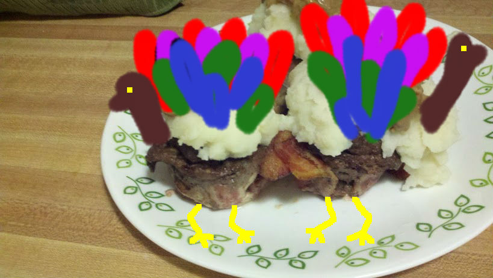

Turkey-Cakes
==========

A recipe for a delicious beefy snack (if you have a good imagination).  Turkey Cakes are basically meat loaf cooked in single serving cup cake tins.  However, they allow a greater level of customization with toppings and ingredients.

Rationale
----------
I am giving a presentation soon to demonstrate Git to an audience that is composed of both developers and analysts.  Using a recipe will give me an opportunity to represent a developer-centric topic to non-developers.

Cooking and Programming have many similarities. They both have inputs, outputs, unit tests and defined processes. In addition, just like software it is a cultural norm to share and modify recipes.  Finally, like the private software industry, most food producers never share their recipe.

Feel free to fork this repository and make your own rendition.  I will try out any pull requests.

Ingredients
----------

- 1 pound 70%+ Lean Ground Turkey
- 1 package French and Onion Soup mix
- 1 Diced Onion
- 2 Minced Garlic Cloves
- 3 Slices of Bread cubed and left out Overnight
- 2 Eggs
- 1/2 pound Turkey Bacon Strips
- 1 container Sour Cream
- Chives
- Cayenne Pepper 

Tools
----------
- 1 baking pan
- 2 Disposable Aluminum Cupcake Tin
- Tongs
- Big Old Knife

Process
----------

==Prep (5 minutes)
1. Preheat the oven to 350 degrees.
2. Using the knife, cut small holes in the bottom of the cup cake tin. This will allow grease and all the bad stuff leak out the bottom of the tin.
3. Smash up the stale bread into smaller bits
4. Pull the bacon out and set aside for a bit.
5. Practice your turkey calls... you'll need this later

==Making the Turkey Cups (15 minutes)
1. Open the package of `turkey bacon` and layer the turkey bacon across the cup cake tin. Make sure to fill in the bottom of the cupcake tin. The turkey bacon will be used as a container to hold the ground turkey mixture.
2. Put the cupcake tins on the cookie sheet and throw the turkey bacon cups in the oven for 15 minutes.  This should crisp up the turkey bacon.

==Mixing the Turkey Mixture (20 minutes)
1. Brown the Onion and Garlic in a pan with a little bit of oil and salt.  Take the Onion/Garlic combo off the heat and let it cool down.
2. Throw the `Ground Turkey`, `French and Onion Soup mix`, `Browned Onion/Garlic`, `Stale Bread Bits` and `Eggs` in a big bowl.  Mix together until uniform consistency.
3. Create 12 uniform meatballs and insert into the cupcake tin.

==Baking (1 hour 15 minutes)
1. Tent the cupcake tin with aluminum foil and throw it in the oven.
2. Bake at 350 degrees for 45 minutes.
3. Uncover and bake for another 15 minutes or until center of Turkey Cake is 165 degrees.
4. Let them bad boys cool for 10-15 minutes.

==Serving
1. Using the tong, pull the Turkey Cakes and place them on a serving tray.
2. Frost the Turkey Cakes with sour cream and sprinkle with diced chives and cayenne pepper.
3. Call your family to the table with your Turkey call
4. Serve!